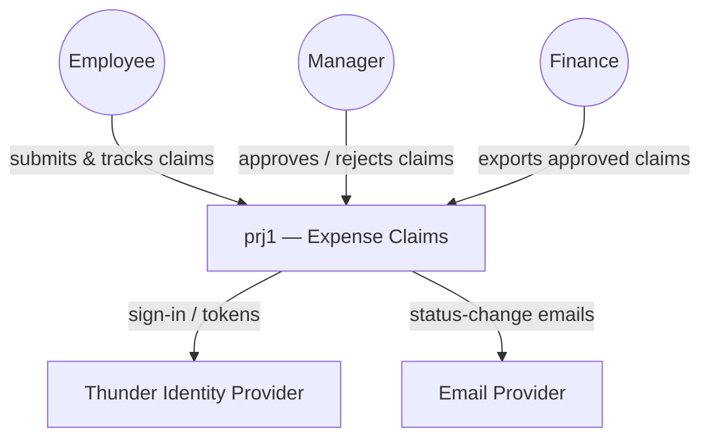
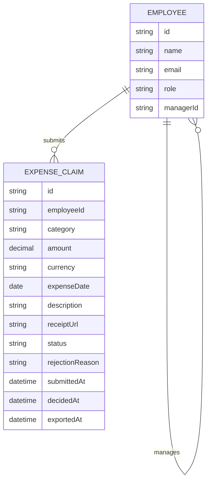
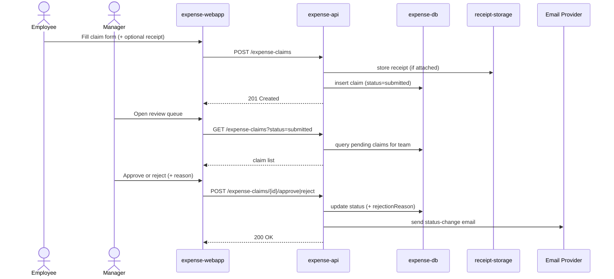
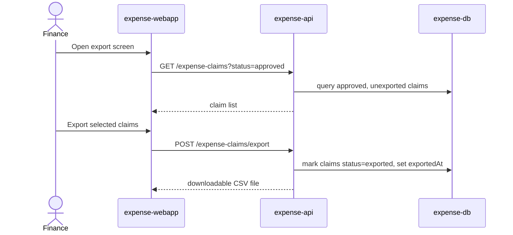

# prj1 — Expense Claims — Design

A single-page web app (`expense-webapp`) gives Employees, Managers, and Finance
role-scoped views onto one backend service (`expense-api`), which owns expense
claims end to end: submission, manager approval/rejection, and finance's export
to a payroll-ready file. Claim data and audit fields live in `expense-db`;
receipt attachments live in `receipt-storage`; status-change emails go out
through an external email provider. Every user signs in through Thunder.

## Context (C1)

## Domain model (ER)

`status` is one of `submitted`, `approved`, `rejected`, `exported`. A claim
moves `submitted -> approved -> exported`, or `submitted -> rejected -> submitted` (on resubmission, with a fresh `submittedAt` and cleared
`rejectionReason`). `role` is one of `employee`, `manager`, `finance`.

## Key flows

### Submit, approve, reject

### Export to payroll

